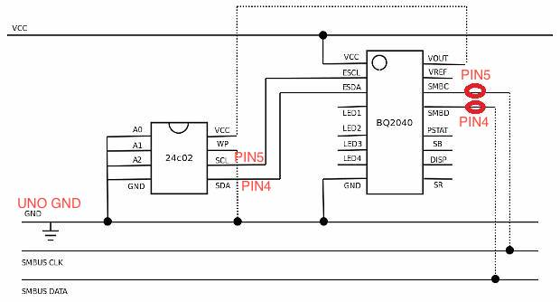

# Simple abstraction to communicate with BQ2040 chip

This is an old personal project that I am now making public. It is an abstraction designed to handle BQ chips in a more efficient and user-friendly manner.

Key features of this project include:

- Sending commands to BQ chips
- Reading from and writing to the EEPROM memory

Now you can reset your battery.

## How to use
Compile the hw_interface.ini and flash the binary in the arduino.
Run the CLI and stablish the commutation with arduino by serial port.
```
# run help the command help to see the available commands

help
``` 

```
# simple example

read_eepron 0X12
```

## Serial command table
|Command|Function|Code|Access|Units|
|-|-|-|-|-|
|a|	SerialNumber |	0x1c |	read |	integer |
|b|	ManufacturerName |	0x20 |	read |	string |
|c|	DeviceName|	0x21 |	read |	string |
|d|	DeviceChemistry |	0x22 |	read |	string |
|e|	ManufacturerData |	0x23 |	read |	string |
|f|	RemaningCapacityAlarm |	0x01 |	read/write |	mAh |
|g|	DesignCapacity |	0x18 |	read |	mAh |
|h|	FullChargeCapacity |	0x10 |	read |	mAh |
|i|	ManufactureDate |	0x1b |	read |	- |
|j|	DesignVoltage |	0x19 |	read |	mV |
|k|	End of Discharge Voltage 1 (EDV1) |	0x3e |	read |	- |
|l|	End of Discharge Voltage Final (EDVF) |	0x3f |	read |	- |
|m|	BatteryMode |	0x03 |	read/write |	bit flag |
|n|	Battery Status |	0x16 |	read |	bit flags |
|o|	ChargingCurrent |	0x14 |	read |	mA |
|p|	ChargingVoltage |	0x15 |	read |	mV |
|q|	CycleCount |	0x17 |	read |	cycle |
|r|	FLAG1 and FLAG2 |	0x2f |	read |	bit flags |
|s|	RemainingCapacity |	0x0f |	read |	mAh |
|t|	RelativeStateOfCharge |	0x0d |	read |	percent |
|u|	AbsoluteStateOfCharge |	0x0e |	read |	percent |
|v|	AverageTimeToFull |	0x13 |	read |	minutes |
|w|	AverageTimeToEmpty |	0x12 |	read |	minutes |
|x|	Voltage |	0x09 |	read |	mV |
|y|	ManufacturerAccess |	0x00 |	read/write |	- |
|z|	AtRate |	0x04 |	read/write |	mA |
|A|	AtRateTimeToFull |	0x05 |	read |	minutes |
|B|	AtRateTimeToEmpty |	0x06 |	read |	minutes |
|C|	AtRateOK |	0x07 |	read |	Boolean |
|D|	Temperature |	0x08 |	read |	0.1°K |
|E|	Current |	0x0a |	read |	mA |
|F|	AverageCurrent |	0x0b |	read |	mA |
|G|	MaxError |	0x0c |	read |	percent |
|H|	RunTimeToEmpty |	0x11 |	read |	minutes |
|J|	RemainingTimeAlarm |	0x02 |	read/write |	minutes |
|I|	SpecificationInfo |	0x1a |	read |	- |
|R{addr}#|	Read eepron|	-|	read |	HEX|
|W{addr}#{data}#|	Write eepron|	-|	write|	- |
|Reserved |	0x1d - 0x1f |	- |	- |

## Circuit

